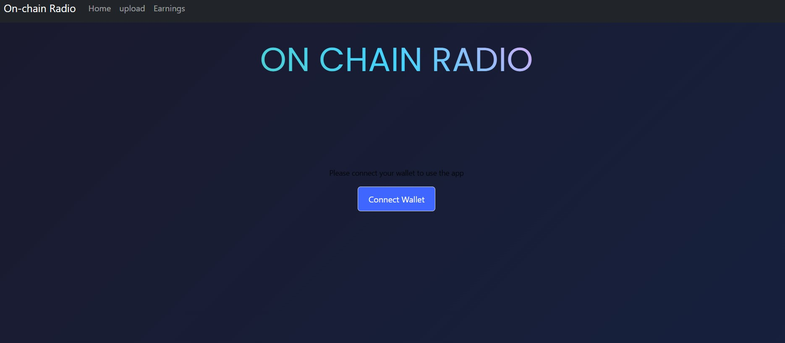
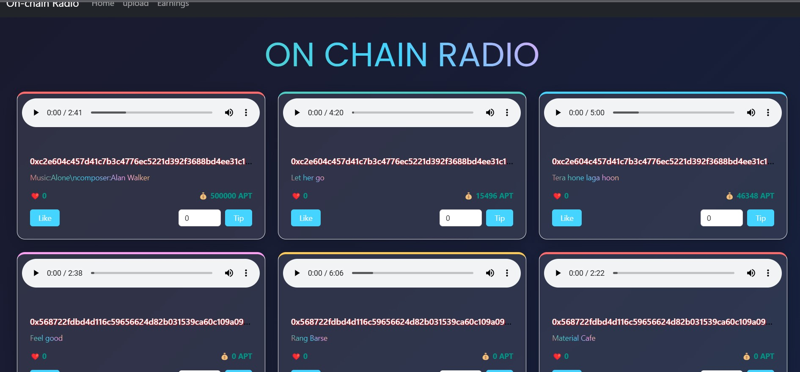
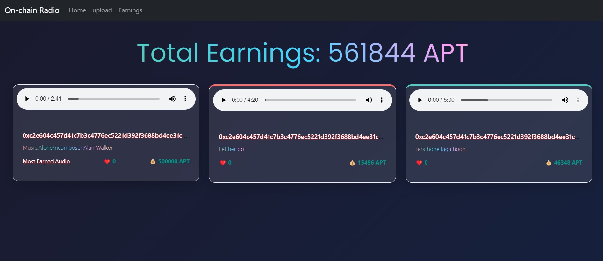
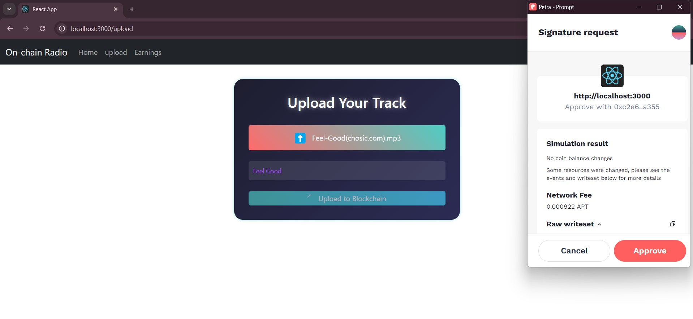

# Inter IIT 12.0: PS Aptos On Chain Radio

## Presentation Link [PPT Link](https://docs.google.com/presentation/d/1DWgt6n41SCE1uTi_qEYooIsfHtWrq2lC/edit?usp=sharing&ouid=114165480588567319258&rtpof=true&sd=true)

## Project Overview

This project is part of Inter IIT 12.0 and focuses on developing a decentralized application (DApp) that allows users to upload their music. In this DApp, users can like tracks, tip their favorite artists, and engage with trending videos. Note that advertising features are not included in this version.

## Features

- **Music Uploads**: Users can easily upload their tracks.
- **Likes and Tips**: Users can express their appreciation through likes and tips(cryopo transfer).
- **Interactive Interface**: A user-friendly frontend to enhance interaction.

## Project Structure

- **Move Folder**: Contains the Aptos Move smart contract.
- **src Folder**: Includes all frontend and interaction files.

## Getting Started

To set up the project locally, follow these steps:

1. Clone the repository:
   ```bash
   git clone https://github.com/prateushsharma/inter_iit_aptos.git
2. Install Dependencies
   ```bash
   npm install
3. Start React Server
   ```bash
   npm start


# Home Page

# Earnings Page

# Upload Page

